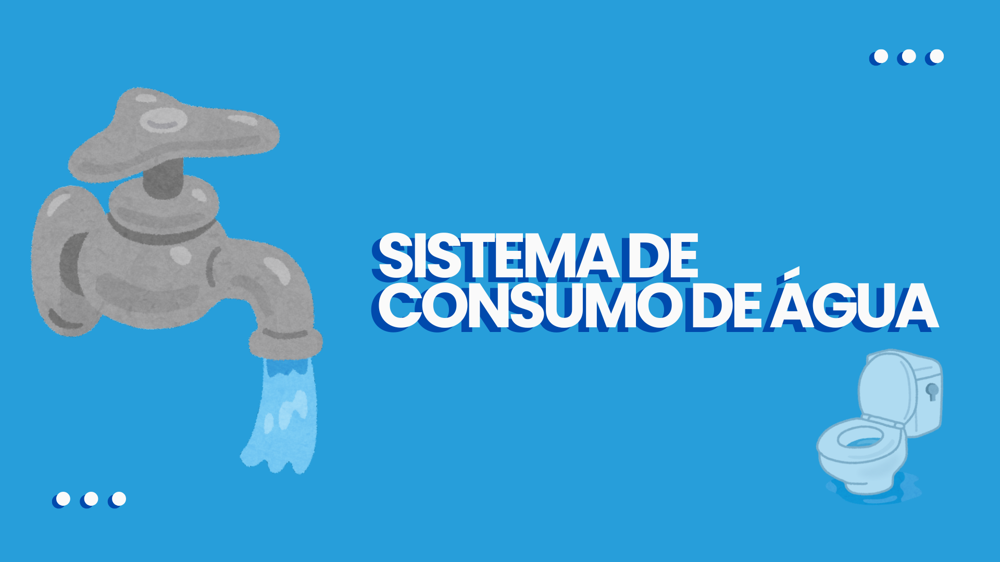

<p align="center">
  
</p>

# 🚰 Sistema de Consumo de Água

- O programa classifica o tipo de consumo com base no tipo do imóvel e metros cúbicos (m³).

## 🛠️ Tecnologias: 
 
 
 

## 📋 Descrição

Este programa em Python ajuda você a:

- Classificar o **consumo de água** com base no tipo de imóvel
- Identificar se o consumo é **econômico**, **moderado** ou **excessivo**
- Aplicar tratamento especial para imóveis **comerciais**
- Conscientizar sobre o uso da água 

## ⚡ Funcionalidades

- Solicita o **tipo de imóvel**
- Solicita o **consumo mensal de água (m³)**
- Verifica o tipo de imóvel e o consumo
- Classifica o consumo em: **econômico**, **moderado** ou **excessivo**
- Aplica tratamento especial para imóveis **comerciais**

## 🚀 Como Executar

**Pré-requisitos**
- Python 3.14 instalado

**Passo a passo**

1. Clone o repositório:
    ```bash
    git clone https://github.com/oraulbarbosa/sistema_consumo.git
    ```
2. Acesse a pasta do projeto:
   ```bash
   cd sistema_consumo
   ```
3. Execute o programa:
   ```bash
   python app.py
   ```
4. Digite o nome do cliente e o valor da compra quando solicitado.

## ⚙️ Regras de Consumo

| Tipo de Imóvel | Consumo (m³) | Classificação |
|----------------|--------------|---------------|
| Comercial | Qualquer | Tarifa comercial |
| Apartamento/Casa | Até 10 | Consumo econômico |
| Apartamento/Casa | 11 a 25 | Consumo moderado |
| Apartamento/Casa | Acima de 25 | Consumo excessivo |

## 🏪 Exemplo 01

**Entrada:**</br>
Digite o tipo de imóvel: Comercial </br>
Digite o consumo mensal de água (m³): 15 </br>

**Saída:**</br>
Tarifa comercial aplicada – consulte o plano corporativo.</br>

## 🏢 Exemplo 02

**Entrada:**</br>
Digite o tipo de imóvel: Apartamento</br>
Digite o consumo mensal de água (m³): 8</br>

**Saída:**</br>
Consumo econômico – excelente controle de água!</br>

## 🏢 Exemplo 03

**Entrada:**</br>
Digite o tipo de imóvel: Apartamento</br>
Digite o consumo mensal de água (m³): 22</br>

**Saída:**</br>
Consumo moderado – dentro do padrão residencial.</br>

## 🏠 Exemplo 04

**Entrada:**</br>
Digite o tipo de imóvel: Casa</br>
Digite o consumo mensal de água (m³): 23</br>

**Saída:**</br>
Consumo moderado – dentro do padrão residencial.</br>

## 🏠 Exemplo 05

**Entrada:**</br>
Digite o tipo de imóvel: Casa</br>
Digite o consumo mensal de água (m³): 26</br>

**Saída:**</br>
Consumo excessivo – adote medidas de economia e verifique vazamentos.</br>

## 🏢 Exemplo 06

**Entrada:**</br>
Digite o tipo de imóvel: Apartamento</br>
Digite o consumo mensal de água (m³): 27</br>

**Saída:**</br>
Consumo excessivo – adote medidas de economia e verifique vazamentos.</br>

## 👤 Autor

**Raul Barbosa**

- GitHub: [@oraulbarbosa](https://github.com/oraulbarbosa)

## 📄 Licença

Este projeto está sob a licença MIT.
